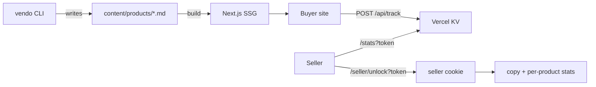

# Vendo

Garage-sale catalog for a moving sale — git-backed products, WhatsApp contact, minimal first-party analytics. Portfolio project.

**Live demo:** _(add URL after deploy)_

## Problem

Publishing items across your own site, MercadoLibre, and Facebook means retyping titles, prices, photos, and descriptions everywhere. Tracking what's available vs reserved vs sold is manual. You want to know if anyone is looking — without paying for heavy analytics.

## Solution

A Next.js catalog where **git is the CMS**: one markdown file per product, images in `public/`, deploy to Vercel. Buyers browse on mobile, tap WhatsApp, and you manage inventory via a local CLI.



## Stack

| Layer | Choice | Why |
|-------|--------|-----|
| Framework | Next.js 15 App Router | SSG product pages + API routes |
| Package manager | pnpm | Fast installs, strict lockfile ([ADR 001](docs/decisions/001-stack.md)) |
| Content | Markdown + YAML frontmatter | Git is the database |
| Styling | CSS tokens + CSS Modules | Intentional UI, no generic kit ([ADR 004](docs/decisions/004-styling.md)) |
| Images | Native ``, no transforms | Zero Vercel image processing cost |
| Analytics | Vercel KV + `/api/track` | First-party, bot-filtered, Hobby-tier |
| CLI | `tsx scripts/vendo.ts` | Local authoring, no production admin |

## Quick start

```bash
pnpm install
cp .env.example .env.local   # edit WHATSAPP_NUMBER, SELLER_SECRET, STATS_SECRET
pnpm dev
```

Open [http://localhost:3000](http://localhost:3000).

## CLI

The CLI is **local to this repo** — no global install (`pnpm link --global`) needed. It writes to `content/products/` and `public/products/` relative to the **current working directory**, so run it from the repo root (or use `pnpm --dir` below).

**From the repo root** (canonical):

```bash
cd /path/to/vendo
pnpm vendo list
```

**From another directory** (no alias, no global link):

```bash
pnpm --dir /path/to/vendo vendo list
pnpm --dir /path/to/vendo vendo add --title "..." --price 120000 --images ./photos/foo.jpg
```

`--images` paths are still relative to wherever you run the command from, not the repo.

**Optional shell alias** (personal setup in `~/.zshrc`, not part of the project):

```bash
alias vendo='pnpm --dir ~/code/active/vendo vendo'
```

Commands:

```bash
pnpm vendo list

pnpm vendo add \
  --title "Mesa comedor" \
  --price 120000 \
  --tags muebles,comedor \
  --images ./photos/mesa.jpg

pnpm vendo edit silla-ikea-markus --price 80000
pnpm vendo status silla-ikea-markus sold
pnpm vendo hide silla-ikea-markus
pnpm vendo delete silla-ikea-markus
```

Slugs are auto-generated from the title (lowercase, hyphenated, no accents) unless you pass `--slug`.

## Environment variables

| Variable | Purpose |
|----------|---------|
| `SITE_URL` | Canonical URL for OG tags, WhatsApp pre-fill, cross-post copy |
| `WHATSAPP_NUMBER` | E.164 without `+` (e.g. `5491112345678`) |
| `SELLER_SECRET` | Token to unlock seller mode (`/seller/unlock?token=…`) — cross-post copy and per-product stats |
| `STATS_SECRET` | Token for the global stats dashboard (`/stats?token=…`) |
| `KV_*` | Vercel KV credentials (server-only; not used in URLs) |

## Deploy (Vercel)

1. Push to GitHub and import in Vercel
2. Add env vars from `.env.example`
3. Create a Vercel KV store and link it to the project
4. Deploy — product pages are statically generated at build time; seller tools load client-side when the seller cookie is present

## Seller mode

Unlock once per browser:

```
/seller/unlock?token={SELLER_SECRET}
```

Or on any page: `?seller={SELLER_SECRET}` (redirects without the token in the URL).

Logout: `/seller/logout` clears the seller cookie and redirects to `/`.

The token must match `SELLER_SECRET` exactly. Wrong token shows a brief message on the home page.

**Session storage:** an httpOnly cookie named `vendo_seller` (not localStorage). Check it in DevTools → Application → Cookies after unlock.

**Where to see seller tools:** open a **product page** (`/{slug}`). The home page has no seller panel. After unlock, each product page fetches `/api/seller/product-tools` and shows:

- **Copy publicación** button
- A compact **per-product stats** block (views, WhatsApp clicks, copies)

**Buyer preview:** with the seller cookie, a header button toggles between *Modo vendedor* and *Ver como comprador*. The preference is stored in `localStorage` (`vendo_view_mode`); the auth cookie is unchanged.

`copy_crosspost` events are accepted by `POST /api/track` only with a valid seller cookie.

## Analytics

Three event types: `pageview`, `whatsapp_click`, `copy_crosspost`.

`POST /api/track` rejects bots and LLM crawlers **before** writing to KV:

- `isbot` User-Agent matches
- LLM crawlers: GPTBot, ClaudeBot, anthropic-ai, Google-Extended, CCBot, Bytespider, etc.
- Missing/short User-Agent
- Prefetch requests (`Sec-Purpose: prefetch`)

`copy_crosspost` requires a valid seller session cookie (see [ADR 005](docs/decisions/005-seller-auth.md)).

View global aggregates at `/stats?token={STATS_SECRET}`. Wrong token → 404. Good enough for a personal sale and portfolio demo — not high-security analytics.

Retention: ~5k events or 30 days (whichever limit hits first).

**Cost note:** No Image Optimization, SSG product pages, one small API route, KV free tier on Hobby — near-zero marginal cost.

## Architecture docs

| Doc | Purpose |
|-----|---------|
| [AGENTS.md](AGENTS.md) | Instructions for AI agents |
| [docs/project-brief.md](docs/project-brief.md) | Problem, solution, success criteria |
| [docs/context-model.md](docs/context-model.md) | Entities, status rules |
| [docs/decisions/](docs/decisions/) | Architecture decision records |
| [docs/prompts/build-v1.md](docs/prompts/build-v1.md) | V1 build spec |

## License

Private / portfolio use.
